# CubeSharp

Cubesharp is a 3D modelling software written in pure C# and OpenGL(OpenTK) [rid-Unity]. Quite a lot of common used functionalities in other modelling software has been integrated in Cubesharp to make it utility but a toy.

## Installation

On Windows, well configure your Visual Studio and confirm its support for Nuget, which should reslove dependencies automatically. Just after an compilation and a run the installation completes. On Linux you can choose to build the project with `xbuild`, and you can find the executable in bin/Debug or bin/Release. Another option is MonoDevelop with CubeSharp.sln open in it.

## Basic Usage

1. Move the camera using middle mouse button(rotation), right button(translation) and mouse wheel(scaling).
2. Left button to select elements on the canvas. When an element turns red, it is being selected.
3. Select on the right pane to operate your model. Just try them all out!

### Transformers

<table>
<tr>
    <td>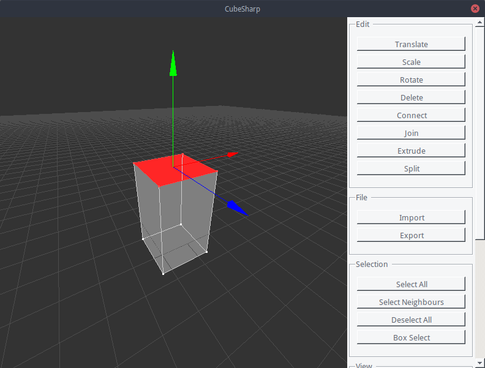</td>
    <td>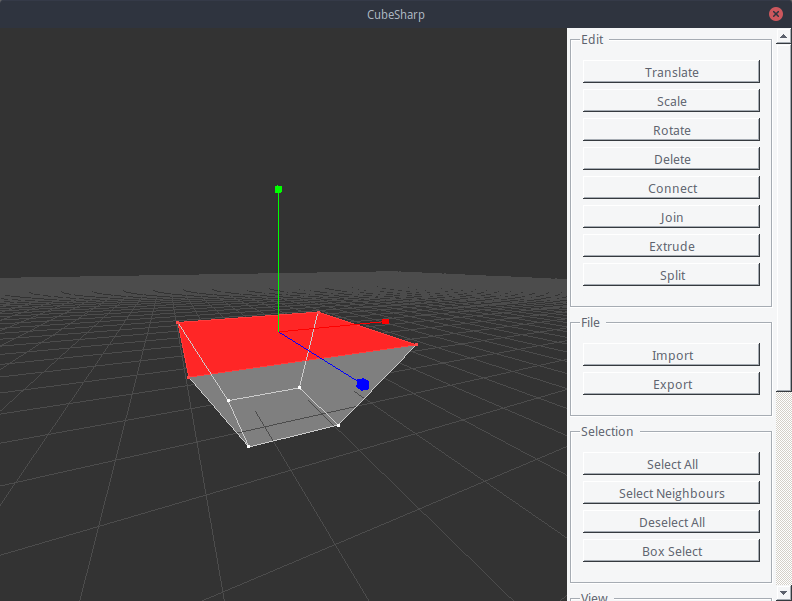</td>
    <td>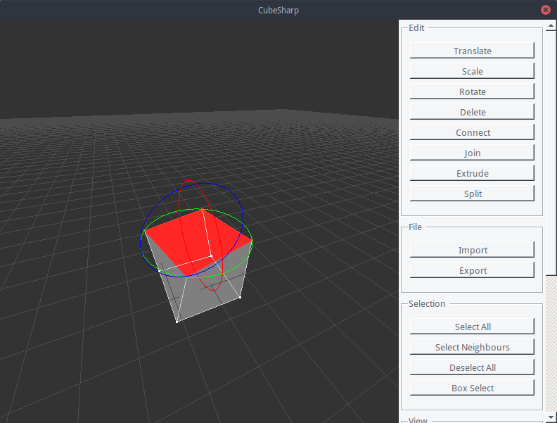</td>
</tr>
<tr>
    <td>Translating a cube facet brings about a longer cube</td>
    <td>Scaling a cube facet brings about a Tokyo Big Sight</td>
    <td>Rotating a cube facet brings about a Cayan Tower</td>
</tr>
</table>

### Split/Join

Split a facet with an edge or split an edge with a vertex as you like. Left click for the position where you want to start breaking, and right click to end the process.

<table>
<tr>
    <td>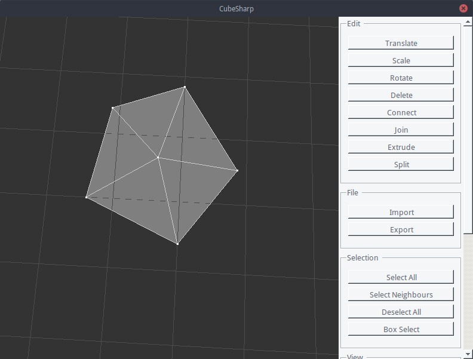</td>
    <td>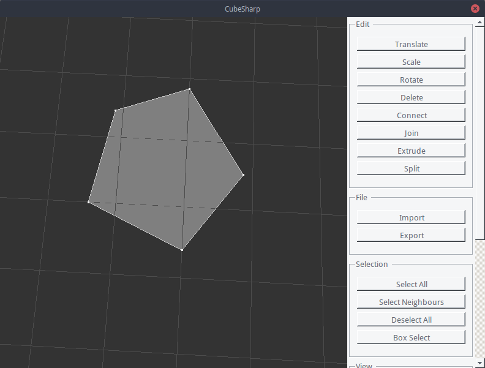</td>
</tr>
<tr>
    <td>Before Joined (After Splitted)</td>
    <td>After Joined (Before Splitted)</td>
</tr>
</table>

### Connect/Delete

Connection between vertices may produce edges or facets (based on the count). Selecting elements and clicking Connect button does this job. Deleting a vertices may also delete any adjacent facets and edges. Same thing happens to deletion on edges.

<table>
<tr>
    <td>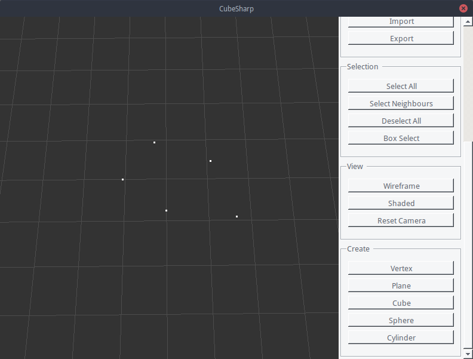</td>
    <td>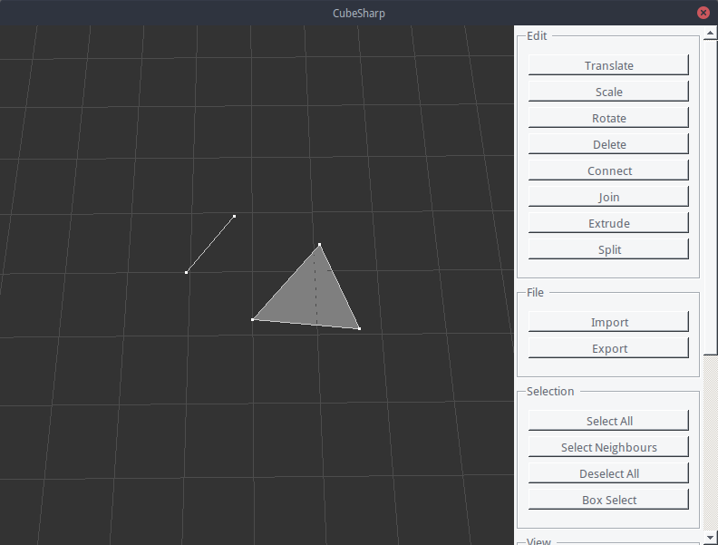</td>
</tr>
<tr>
    <td>Before Connection (After Deleting Edges)</td>
    <td>After Connection (Before Deletion)</td>
</tr>
</table>

### Extrude

Extruding gives you a chance to create a pop out (or erect) volume right out of the original facet.

<table>
<tr>
    <td>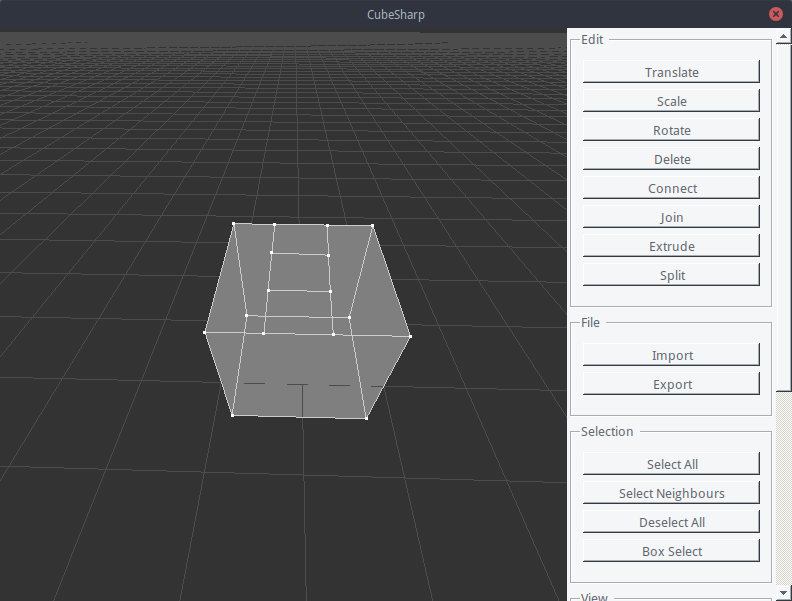</td>
    <td>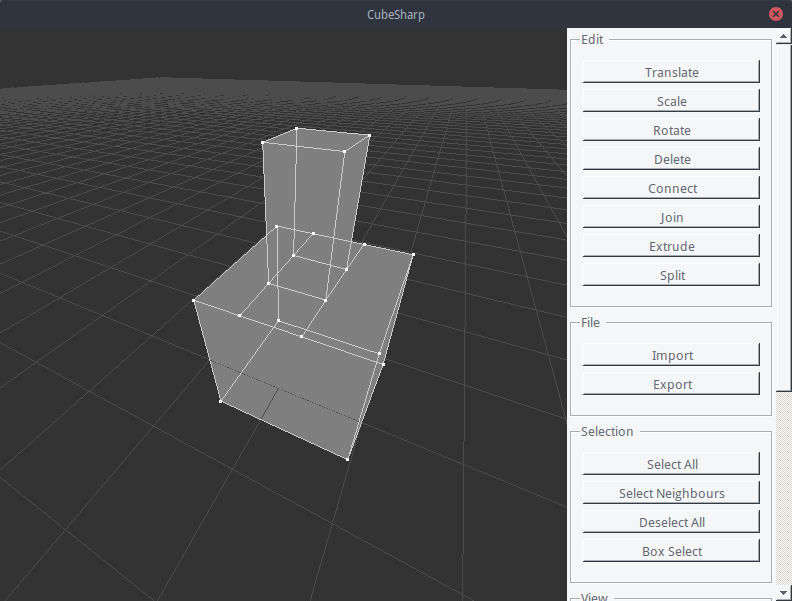</td>
</tr>
<tr>
    <td>Before Extrude(Splitted Cube)</td>
    <td>After Extrude</td>
</tr>
</table>

### Import/Export

(Coming Soon)

### Selection

<table>
<tr>
    <td>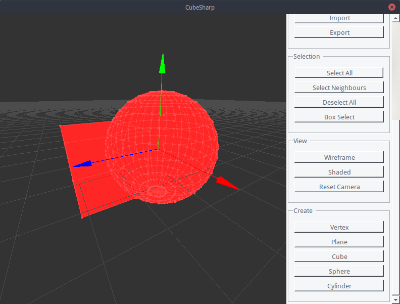</td>
    <td>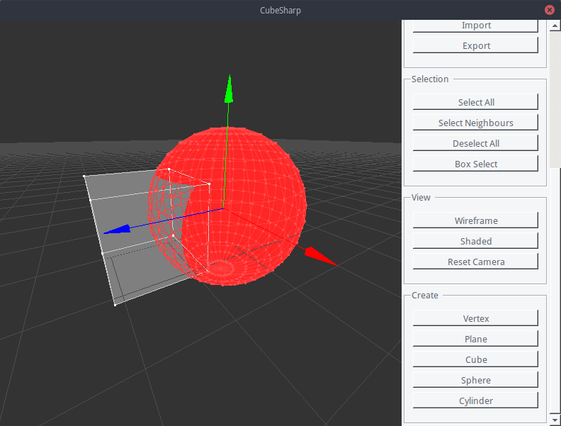</td>
    <td>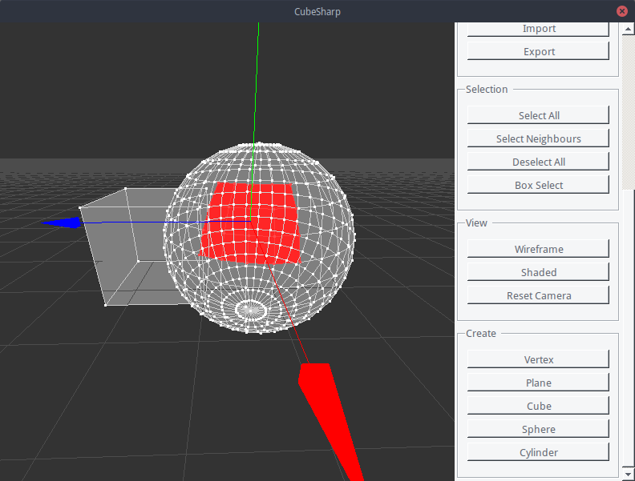</td>
</tr>
<tr>
    <td>All are painted in red.</td>
    <td>Select all elements reachable.</td>
    <td>Select things by dragging a box</td>
</tr>
</table>

### Shading Mode

Wireframe mode for precisely controling the model and shaded mode for art effects.

<table>
<tr>
    <td>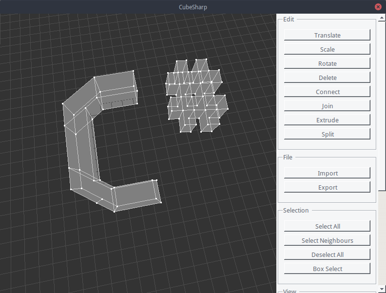</td>
    <td>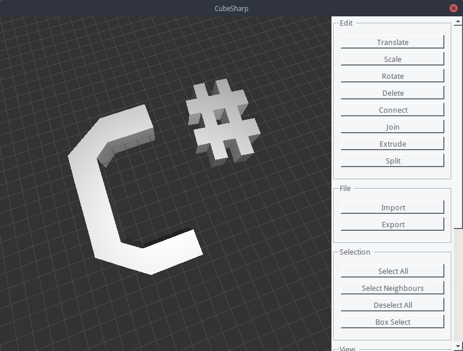</td>
</tr>
<tr>
    <td>Wireframe Mode(Edit Mode)</td>
    <td>Shaded Mode(Preview Mode)</td>
</tr>
</table>

## Note on Development

Here are some notes for code readers and maintainers.

### Renderer

Each frame is consist of multiple render passes, and each render pass is controller by a renderer. All of them are defined in `Renderer.cs`. There are renderers that are in charge of rendering the model itself, renderers that are in charge of rendering the transformers, and others are in charge of some miscellaneous UI elements. Some will not render to the screen visibly and render to video memory (render target). We will talk about it in the next section.

### Cast and Selection

We calculate cast by fetch projection data from graphics card. An concept called ObjectMap exists in this project, representing which object is occupying which pixel. It is actually the decoded content in attached texture. Information is encoded in this way:

Bits | 4 | 28 | 32 | 32 | 32
-----|---|----|----|----|----
Data | Object Type | Object Index | Position X | Y | Z

When a selection is done, object map is fetched and decoded. When users simply clicked, an algorithm will find the element which has the most priority (including the type priority and the distance from click coordinate). When users box select, another algorithm will traverse pixels the box area covers and select everything.

### FuncPanel

FuncPanel is the name of the right pane. All buttons and groups are generated by using reflection, so functionalities are very convenient to add or remove.

### MeshGraph

This is core of this project. A MeshGraph is a plannar GRAPH in graph theory, as well as general triangle MESH data in graphics. It manages MeshVertex, MeshEdge and MeshFacet as its members, and process their adjacency relations. All mesh relavant algorithms are implemented in this class. We demand the `Meshxxxx` should have functionalities as follows:

- MeshVertex: it should be able to list its adjacency edges and facets
- MeshEdge: it should be able to list its adjacency facets and endpoints.  To note that direction is very important and strict in graphics.
- MeshFacet: it should be able to list its vertex sequence and edge sequence as well as calcuate its normal vector.

